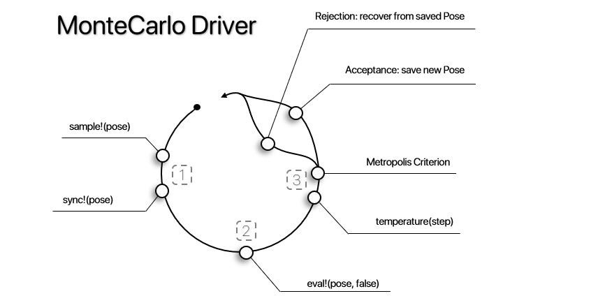

```@meta
CurrentModule = ProtoSyn.Drivers
```

# Monte Carlo Driver

The [Monte Carlo Driver](@ref) uses a sampling `AbstractMutator` to generate a conformational change, evaluating it accoridng to a given [`EnergyFunction`](@ref ProtoSyn.Calculators.EnergyFunction) or custom evaluating function, and deciding wether to keep the new [`Pose`](@ref) or return to the previous [`State`](@ref) according to the Metropolis Criterion.

```@docs
MonteCarlo
MonteCarloState
```



**Figure 1 |** A schematic overview of the different stages in a [`MonteCarlo`](@ref) `Driver`: **(1)** - Sampling a new conformation; **(2)** - Evaluating the new [`Pose`](@ref); **(3)** - Metropolis Criterion, the new [`Pose`](@ref) conformation is either accepted (in which case it is saved as a reference for further steps in the simulation) or rejected (where the current state is recovered from a saved [`Pose`](@ref) to the previous step).