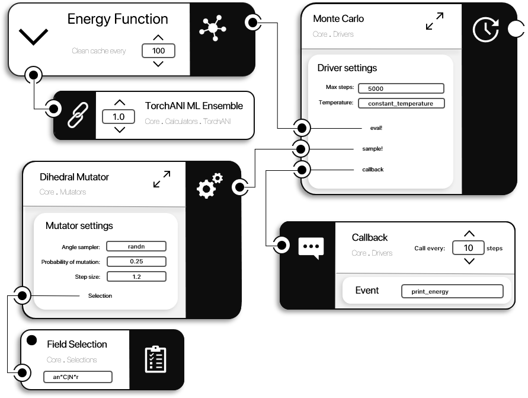

```@meta
CurrentModule = ProtoSyn.Drivers
```

# Drivers section

A `Driver` is a piece of code that _drives_ the simulation forward. Usually, it includes a set of `AbstractMutator` instances and one or more [`EnergyFunction`](@ref). As such, a `Driver` (in contrast with a simple `AbstractMutator`) is able to make decisions or change the course of the simulation based on the evaluation of the current [`State`](@ref). For example, a [`MonteCarlo`](@ref) simulation may accept or reject a given conformational change (produced by one of more `AbstractMutator` instances) based on the evaluation of the system [`State`](@ref) by a given [`EnergyFunction`](@ref). The current status of a simulation is stored in a `DriverState` instance (each `Driver` type has a corresponding `DriverState` type). For example, this can hold the current step or temperature of the simulation. Each module in ProtoSyn may include a [Drivers section](@ref), adding new `Driver` types and methods. In the next sections, a deeper look into the inner workings of the available `Driver` instances is provided, organized in the following sections:

+ [Callbacks](@ref)
+ [Creating custom callbacks](@ref)
+ [Creating custom drivers](@ref)
+ [Available drivers](@ref)
+ [Creating custom thermostats](@ref)
+ [Available thermostats](@ref)



**Figure 1 |** A diagram of a [`MonteCarlo`](@ref) `Driver`. This `Driver` type
requests an `eval!` component (in this case, an [`EnergyFunction`](@ref ProtoSyn.Calculators.EnergyFunction), with a TorchANI Ensmeble as the single component - see [`get_default_torchani_ensemble`](@ref ProtoSyn.Calculators.TorchANI.get_default_torchani_ensemble)) and a `sample!` component (in this example, a single [`DihedralMutator`](@ref ProtoSyn.Mutators.DihedralMutator)). As the naming implies, an `eval!` component evaluates the system's energy at any given moment in the simulation, while the `sample!` component _drives_ the system from a [`State`](@ref ProtoSyn.State) to the next. Optionally, a [`Callback`](@ref) `callback` can be provided, whose purpose is to periodically return information to the user about the current state of the simulation (i.e.: current step, temperature, energy, etc). In this example, as defined in the [`MonteCarlo`](@ref) `Driver` settings, the simulation will run for 5000 steps, with a constant temperature (see [Available thermostats](@ref) and [Creating custom thermostats](@ref) on how to control the temperature of a simulation).

# Callbacks

[`Callback`](@ref) instances are responsible for returning information from a simulation during its runtime. This object type is usually used in `Driver` instances in order to print information to the user relative to the inner workings of a simulation: the current step, temperature, energy, etc.

```@docs
Callback
```

# Creating custom callbacks

As stated above, [`Callback`](@ref) instances are _functors_, usually called from within the body of a `Driver` instance. As such, a specific signature is expected for the `:event` function:

```julia
callback.event(pose::Pose, driver_state::DriverState)
```

As an example:

```@setup callbacks
using ProtoSyn
```

```@repl callbacks
function event_example(pose::Pose, driver_state::ProtoSyn.Drivers.DriverState)
    println("Step: $(driver_state.step) | Energy: $(pose.state.e[:Total])")
end

callback = ProtoSyn.Drivers.Callback(event_example, 1)
```

!!! ukw "Note:"
    Although possible, changing the input [`Pose`](@ref) `pose` or `DriverState` `driver_state` during the [`Callback`](@ref) call can have unexpected results, and should be used carefully.

# Creating custom drivers

Since certain `Driver` instances may call other `Driver` instances, Protosyn expects a certain signature for custom drivers and the accompanying `DriverState`. A `Driver` is a _functor_, meaning it is a callable object, with the following signature:

```julia
Base.@kwdef mutable struct ExampleDriverState{T <: AbstractFloat} <: DriverState
    step::Int = 0
    # content
end

mutable struct ExampleDriver <: Driver
    callback::Opt{Callback}
    # content
end

function (driver::MonteCarlo)(pose::Pose)
    T = eltype(pose.state)
    driver_state = ExampleDriverState{T}()
    driver.callback !== nothing && driver.callback(pose, driver_state)

    # content
    return pose
end
```

From the previous snippet of code, three important bits can be highlighted: first, the usage of `Base.kwdef` to define default values for the `DriverState` object. Altough not necessary, this eases the creation of starting `DriverState` instances. Second, the initial call to the `:callback` field in the `Driver`, giving as input arguments a [`Pose`](@ref) `pose` and `DriverState` `driver_state`, as expected. Note that this is an optional component of a standard `Driver` in ProtoSyn. Finally, although not necessary, some other `Driver` instances might expect a custom `Driver` to return the modified [`Pose`](@ref) `pose`.

# Available drivers

In this seb-section, the default `Driver` instances made available by the Core module of ProtoSyn are further explored. Note that additional `Driver` types might be made available in other modules (such as [Peptides](@ref)).

+ [`MonteCarlo`](@ref)
+ [`SteepestDescent`](@ref)
+ [`ILS`](@ref)
+ [`CompoundDriver`](@ref)

# Creating custom thermostats

Some `Driver` instances have a `:temperature::Function` field, where the `temperature` function takes the current `:step` of the simulation. This function is often referred to as a _thermostat_, since it regulates the temperature of the simulation, thus controlling the likelihood of acceptance of higher energy states, etc. As such, in order to create a custom thermostat, the following signature should be followed (taking a `step``Int as the single input argument and returning a temperature value, usually as a Float):

```julia
return function custom_thermostat(step::Int)

    # content

    return temperature_value
end
```

# Available thermostats

+ [`get_constant_temperature`](@ref)
+ [`get_linear_quench`](@ref)
+ [`get_quadratic_quench`](@ref)

```@docs
get_constant_temperature
get_linear_quench
get_quadratic_quench
```