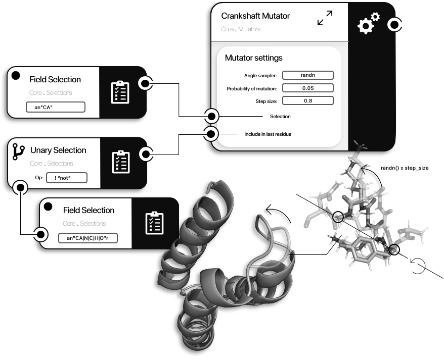

```@meta
CurrentModule = ProtoSyn.Mutators
```

# Crankshaft Mutator

A [`CrankshaftMutator`](@ref) instance changes a [`Pose`](@ref) [`State`](@ref) by introducing one or more crankshaft movements: a concerted rotation, by a given axis, around a virtual axis between two [`Atom`](@ref) instances.

```@docs
CrankshaftMutator
```



**Figure 1 |** A schematic representation of a [`CrankshaftMutator`](@ref) instance. In this example, the selection `an"CA"` selects only pairs of carbon alpha [`Atom`](@ref) instances. For each pair of [`Atom`](@ref) instances possible, a random number (obtained by calling `rand()`) is compared against the [`CrankshaftMutator`](@ref)`.p_mut` field. If the random number is lower, the current [`Atom`](@ref) instance pair is selected for a crankshaft movement. A high value for `p_mut` therefore translates into a higher number of crankshaft rotations in a single call to the [`CrankshaftMutator`](@ref). As a general rule, using a `p_mut` value of `2/N(N-1)` will result in 1 rotation per call of the [`CrankshaftMutator`](@ref), on average (where `N` is the number of atoms in the [`Pose`](@ref) or number of selected atoms by `selection`). A crankshaft movement is a concerted rotation of all [`Atom`](@ref) instances in the [Graph](@ref graph-types) between the two selected [`Atom`](@ref) instances, around an axis formed between the two selected [`Atom`](@ref) instances. The angle of the rotation is calculates from the [`CrankshaftMutator`](@ref)`.angle_sampler` call (with no input arguments), multiplied by [`CrankshaftMutator`](@ref)`.step_size`.