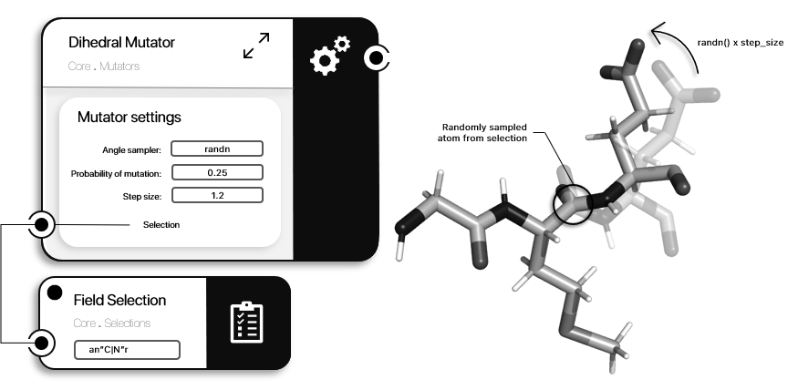

```@meta
CurrentModule = ProtoSyn.Mutators
```

# Dihedral Mutator

A [`DihedralMutator`](@ref) instance changes a [`Pose`](@ref) [`State`](@ref) by introducing one or more dihedral rotations.

```@docs
DihedralMutator
```



**Figure 1 |** A schematic representation of a [`DihedralMutator`](@ref) instance. In this example, the `selection` `an"C$"r` selects only the carbon atoms of the backbone of the peptide, excluding the alpha carbons. The `:Δϕ` field in this [`AtomState`](@ref) instance applies a given dihedral rotation to all children [`Atom`](@ref) instances, therefore setting, in this case, the `psi` dihedral angle of the backbone of this [`Residue`](@ref). As such, by providing the [`DihedralMutator`](@ref) with this `selection`, only the `psi` dihedral angles are being sampled for rotation. Each of the selected [`Atom`](@ref) instances is looped over and one or more instances can be designated for dihedral angle sampling. This is performed by comparing a random number (by calling `rand()`) against the [`DihedralMutator`](@ref)`.p_mut` field, for each of the looped [`Atom`](@ref) instances. If the random number is lower, the current [`Atom`](@ref) instance is selected. A high value for `p_mut` therefore translates into a higher number of dihedral rotations in a single call to the [`DihedralMutator`](@ref). As a general rule, using a `p_mut` value of `1/N` will result in 1 rotation per call of the [`DihedralMutator`](@ref), on average (where `N` is the number of atoms in the [`Pose`](@ref) or number of selected atoms by `selection`). To sample a new dihedral angle, the [`DihedralMutator`](@ref)`angle_sampler` is called (with no input arguments) and multiplied by the [`DihedralMutator`](@ref)`.step_size` field. This value is added to the selected [`AtomState`](@ref)`.Δϕ`.