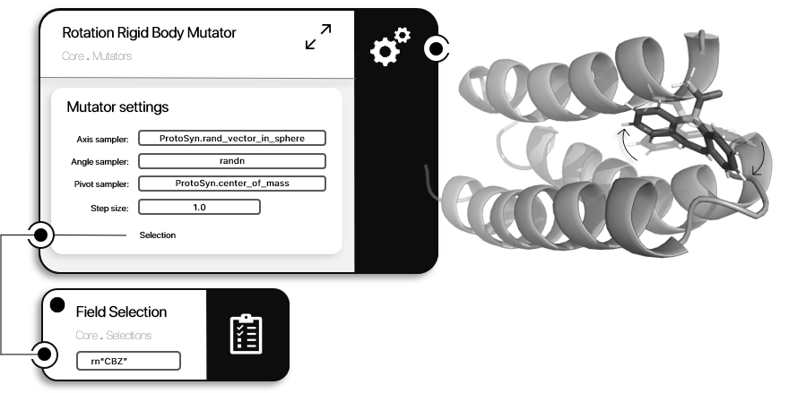

```@meta
CurrentModule = ProtoSyn.Mutators
```

# Rigid Body Mutators

ProtoSyn `Core` module makes available two [Rigid Body Mutators](@ref): the [`RotationRigidBodyMutator`](@ref), which changes a [`Pose`](@ref) [`State`](@ref) by introducing a rigid body rotation; and the [`TranslationRigidBodyMutator`](@ref), which changes a [`Pose`](@ref) [`State`](@ref) by introducing a rigid body translation.

```@docs
RotationRigidBodyMutator
```



**Figure 1 |** A schematic representation of a [`RotationRigidBodyMutator`](@ref) instance. In this example, showcasing a 2 molecule simulation, a [`RotationRigidBodyMutator`](@ref) is applied to a carbamazepine (CBZ) ligand, by selecting it based on the [`Residue`](@ref)`.name` (`rn"CBZ"`). The axis for the rotation is sampled from [`rand_vector_in_sphere`](@ref ProtoSyn.rand_vector_in_sphere), the angle is sampled from `randn` and the pivot position if the [`Pose`](@ref) [`center_of_mass`](@ref ProtoSyn.center_of_mass).

```@docs
TranslationRigidBodyMutator
```


**Figure 2 |** A schematic representation of a [`TranslationRigidBodyMutator`](@ref) instance. In this example, the Mutator is applied to a carbamazepine (CBZ) ligand, by selecting it based on the [`Residue`](@ref)`.name` (`rn"CBZ"`). The translation vector is sampled from [`rand_vector_in_sphere`](@ref ProtoSyn.rand_vector_in_sphere). All the selected atoms will suffer this translation.