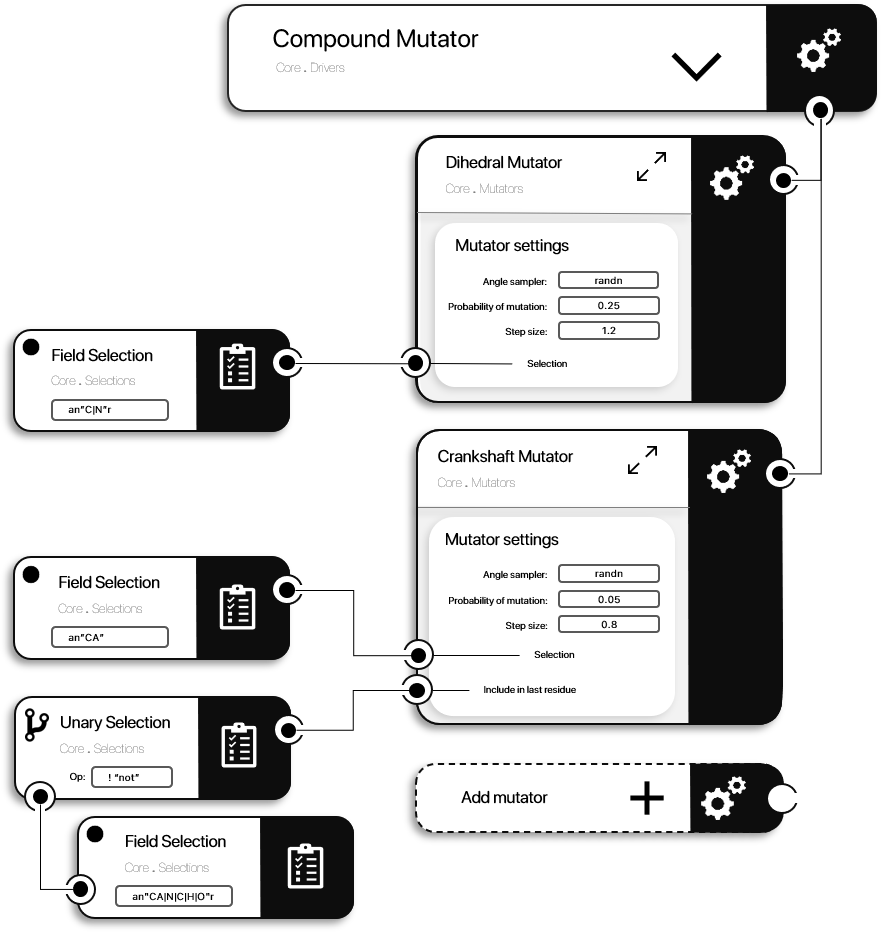

```@meta
CurrentModule = ProtoSyn.Mutators
```

# Mutators section

Each module in ProtoSyn may include a [Mutators section](@ref), containing types and methods allowing ProtoSyn to change a [`Pose`](@ref) instance's from one [`State`](@ref) to another. In other words, a Mutator (of type `AbstractMutator`) is responsible for implementing a given conformational change in a [`Pose`](@ref) (for example, implementing [Dihedral rotations](@ref), among others). In the context of a simulation, this is usually refered as "sampling". In the next section, a further exploration of the available `AbstractMutator` instances is provided, organized in the following sections:

+ [Creating custom mutators](@ref)
+ [Available mutators](@ref)



**Figure 1 |** A diagram of an example [`CompoundMutator`](@ref), bringing together multiple `AbstractMutator` instances. In this example, both the [`DihedralMutator`](@ref) and the [`CrankshaftMutator`](@ref) are represented. Each `AbstractMutator` can be parametrized by a collection of settings, explained in each Mutator's page in this manual. In the case of the exemplified `AbstractMutator` instances, these can receive an optional `selection` (in the example the [`FieldSelection`](@ref) and [`UnarySelection`](@ref) are shown).

# Creating custom mutators

Mutators are most useful when employed in a `Driver` instance (see [Drivers section](@ref)), who expects the following signature. Note that the Mutator instances are `struct` instances (of type `<: AbstractMutator`), but are also _functors_, meaning that are callable by the encompassing `Driver`. For this call, only a [`Pose`](@ref) `pose` instance is given as input, and all conformational changes should be in-place (no output is expected and any internal to cartesian coordinate conversion, or vice-versa, should be requested at the end of the function call). Note that, as a general rule, `AbstractMutator` instances should [`sync!`](@ref) any required internal to cartesian coordinate conversion (or vice-versa) at the start of the function call (using [`i2c!`](@ref ProtoSyn.i2c!) or [`c2i!`](@ref ProtoSyn.c2i!) methods). As an example, [`DihedralMutator`](@ref) syncs any pending cartesian to internal coordinate conversion before applying itself. In the same fashion, at the end of the function call, `AbstractMutators` should request any internal to cartesian coordinate conversion (or vice-versa), depending on the change performed, therefore requesting a pending [`sync!`](@ref). However, `AbstractMutators`
should not [`sync!`](@ref), in most cases. As an example, ten sequential [`DihedralMutator`](@ref) calls do not require a [`sync!`](@ref) between each of them.

```julia
struct NewMutator <: AbstractMutator
    # content
end

function (mutator::NewMutator)(pose::Pose)
    # content
end
```

In order to be able to incorporate any new custom mutator in a [`CompoundMutator`](@ref), an extra signature needs to be present, receiving a subset list of [`Atom`](@ref) instances. In this case, the mutator should only be applied to the [`Atom`](@ref) instances in this subset.

```julia
function (mutator::NewMutator)(pose::Pose, atoms::Vector{Atom})
    # content
end
```

# Available mutators

Besides all the machinery to create custom mutators, ProtoSyn's `Core` module makes available some simple `AbstractMutator` instances. Since this is not a specialized module, available mutators should be indiferent to the type of molecular structure being sampled. As of ProtoSyn 1.0, the following `AbstractMutator` instances are made available from the `Core` module, and can be further explored in the respectivelly dedicated pages of this manual:

* [Dihedral Mutator](@ref)
* [Crankshaft Mutator](@ref)
* [Rigid Body Mutators](@ref)
* [Backrub Mutators](@ref)
* [Compound Mutator](@ref)