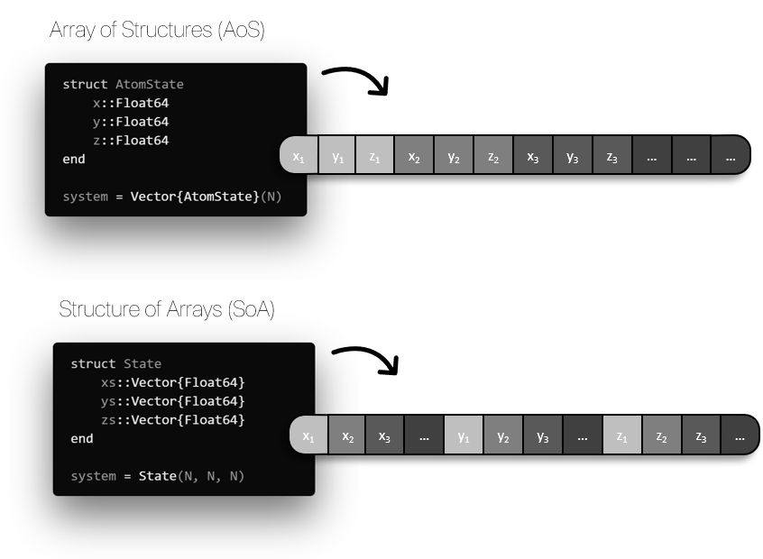

```@meta
CurrentModule = ProtoSyn
```

# [Types] (@id core-types)

In this section we will explore the main `struct` instances that compose the core of ProtoSyn's engine, divided in the following topics, for organization purposes:

+ [Pose](@ref)
+ [Fragment](@ref)
+ [Graph](@ref graph-types)
+ [State](@ref state-types)

## Pose

A pose holds all necessary information regarding a molecular system. This information is divided in the [Graph](@ref state-types) and [State](@ref state-types) .
```@docs
Pose
```
## Fragment

ProtoSyn.jl package uses a pose of a single [`Segment`](@ref) (therefore without a Root) to carry information during certain processes (such as [Building a new peptide from a sequence]).
```@docs
Fragment
```

## [Graph](@id graph-types)

The birectional graph holds the information regarding the hierarchical organization of a molecular system, where the top level of organization is a [`Topology`](@ref) instance, which can contain one or more instances of [`Segment`](@ref). This structure, in turn, is comprised of one or more [`Residue`](@ref) instances, which are themselves a set of [`Atom`](@ref) instances, this being the lowest level of data organization in ProtoSyn.


```@docs
Topology
Segment
Residue
```

!!! ukw "Note:"
    Instead of defining [`Residue`](@ref).name as a String, ProtoSyn uses a specific type ([`ResidueName`](@ref ProtoSyn.ResidueName)) to accomodate specific conventions in aminoacid naming.

```@docs
ProtoSyn.ResidueName
Atom
```

## [State](@id state-types)

A [State](@ref state-types) structure is responsible for holding the current _state_ of the internal and cartesian coordinates, as well as the forces felt on each atom and the resulting energy of the system (as calculated by an [EnergyFunction]). This structure is sub-divided in a list of [`AtomState`](@ref) instances and a [`StateMatrix`](@ref). Both of these structures are complementary, meaning that any change in one in synched in the other. While [`AtomState`](@ref) instances hold both the internal and cartesian coordinates relative to a single [`Atom`](@ref), [`StateMatrix`](@ref) is a 2D matrix of all cartesian coordinates of the atoms in a given [Pose](@ref).

```@docs
State
AtomState
StateMatrix
```

### Array of Structures vs Structure of Arrays

Given this organization of cartesian coordinates in a [Pose](@ref), a decades old dilemma naturally emerges: should the data be organized in Array of Structures or in a Structure of Arrays. The differences are illustrated bellow:

+ Structure of Arrays (SoA) - The main object is a single structure which holds a vector for each of the coordinates of all [`Atom`](@ref) instances. Each coordinate vector of all [`Atom`](@ref) instances is contiguous in memory.
+ Array of Structures (AoS) - The main object is a vector of [`Atom`](@ref) instances, where each [`Atom`](@ref) structure holds a field for each coordinate. Each [`Atom`](@ref) set of coordinates is contiguous in memory.



**Figure 1 |** Visualization of [`Atom`](@ref) instances organization in memory: Structure of Arrays (SoA) vs Array of Structures (AoS). In one hand, when employing the Structure of Arrays (SoA) paradigm, memory is contiguous when accessing all the X coordinates of each [`Atom`](@ref) instance (for example). On the other hand, when employing the Array of Structures (AoS) paradigm, memory is contiguous when accessing all the X, Y and Z coordinates of a single atom (or adjacently indexed atoms).

Given that Julia is a [column major programming language](https://docs.julialang.org/en/v1/manual/performance-tips/#man-performance-column-major) and based on performance benchmarks during early development cycles, ProtoSyn is developed using the **Array of Structures (AoS)** paradigm (each [`State`](@ref) contains an array of structures [`AtomState`](@ref)).