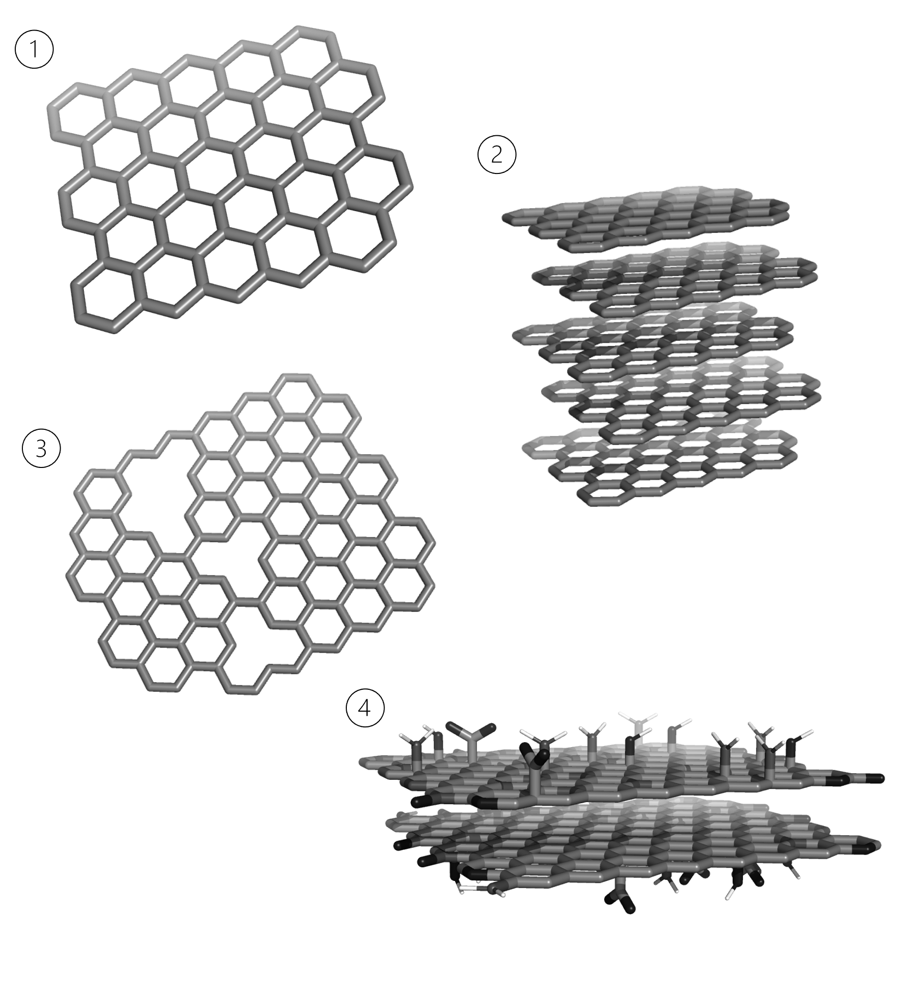

```@meta
CurrentModule = ProtoSyn.Materials
```

# Carbons

In the next section, a brief description of the available methods to generate carbon models is provided. Following the previous work developed on [CarbGen](https://floating-falls-70853.herokuapp.com/) (you can check the Python version on the [project's GitHub page](https://github.com/JosePereiraUA/CarbGen.py)), ProtoSyn implements methods to generate functionalized microcrystallites of multi-layered carbon sheets.



**Figure 1 |** Example showcase of ProtoSyn's carbon microcrystallite generation methods. **1 |** Single carbon sheet. **2 |** Multi-layered carbon microcrystallite. **3 |** Micro-porosity generation. **4 |** Functionalization. ProtoSyn includes several common functional groups, by default, on the `ProtoSyn.modification_grammar`. The shown example includes ether groups, carboxyls, carbonyls, hydroxyls, amine-N groups, graphitic-N, oxidized-N groups and pyridines.

```@docs
generate_carbon_layer
generate_carbon
generate_porosity
functionalize!
add_functionalization!
generate_carbon_from_file
```