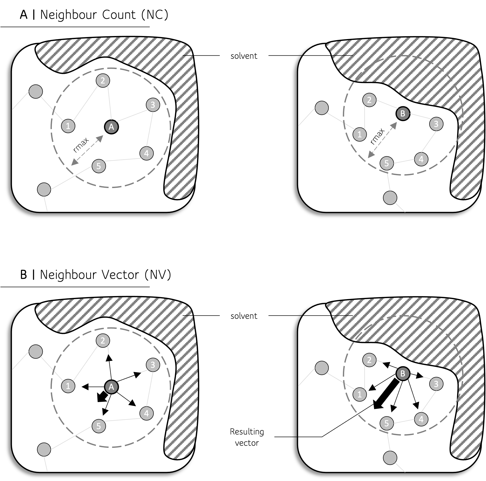
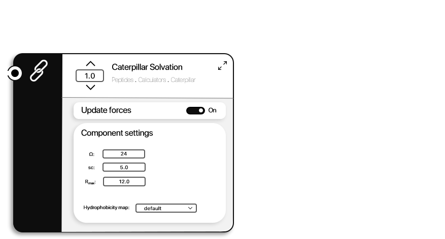

```@meta
CurrentModule = ProtoSyn.Peptides.Calculators.Caterpillar
```

# Caterpillar Solvation

The [Caterpillar Solvation](@ref) energy is a coarse-grained approximation to a solvation energy contribution, introducing a penalty for the exposure of hydrophobic [`Residue`](@ref) instances and a penalty for the burial of hydrophylic [`Residue`](@ref) instances (and vice-versa). 

The Caterpillar solvation energy calculation is based on the work of Coluzza
et al (see [this paper](https://journals.plos.org/plosone/article?id=10.1371/journal.pone.0020853)).

The ProtoSyn's modifications introduce a significant degree of complexity, futher explained bellow. In sum, the calculation takes 2 steps: the [Burial degree calculation](@ref) and the [Hydrophobicity weight calculation](@ref).


## 1. Burial degree calculation

In this step, a given algorithm loops over all the residues (selecting a given
atom for distance matrix calculation) and identifies the burial degree of each
residue (this step can be parametrized by (1) the burial degree algorithm, (2)
the identification curve, (3) the selection atom, (4) the rmax cut-off and (5)
slope control sc. These settings are further explained bellow).

### 1.1 Burial degree algorithm
ProtoSyn offers 2 different burial degree identification algorithms, the Neighbour Count (NC) and Neighbour Vector (NV) (as explained further in [this paper](https://pubmed.ncbi.nlm.nih.gov/19234730/)). In comparison to eachother, NC algorithms only take into consideration the number of selected atoms within a defined `rmax` range, while NV algorithms also take into consideration the orientation of neighbouring residues to defined the burial degree. As such, in general, NV algorithms are more precise, while carrying an additional performance weight.

```@docs
neighbour_count
neighbour_vector
```



**Figure 1 |** Visualization of [`neighbour_count`](@ref) and [`neighbour_vector`](@ref) algorithms for burial degree calculation. **A - Neighbour count -** Since only the number of selected atoms within the `rmax` cutoff is accounted for, both depicted conformations are measured as having the same burial degree, even though atom B is more exposed to the system's solvent. **B - Neighbour vector -** Using the neighbour vector algorithm, the resulting vector from summing all individual vectors from the selected atom towards all neighbouring selected atoms (within `rmax`) provides a more clear distinction between exposed or non-exposed [`Atom`](@ref) instances: resulting vectors with higher magnitude are linearly and positively correlated with atoms with more exposed surfaces. Note that, on average, the NV algorithm was measured to be 4-5x slower than NC.

### 1.2 Identification curve
The available identification curves are `linear`, `sigmoid` and `normalized sigmoid`
(in NV algorithms only). Note that the definition of the identification curve
controls the amount of distance information considered for the calculation of
the burial degree: linear identification curves incorporate more distance
information than sigmoid identification curves (normalized sigmoid, in NV
algorithms, use the least distance information, similar to NC algorithms).

```@docs
linear
sigmoid
sigmoid_normalized
```

### 1.3 Selection atom
This can be any selection that yields an atom. However, in most cases applied
to proteins, either the Cα or Cβ atoms should be chosen.

### 1.4 `rmax` cutoff
This can be any float number, however, the range between 9.0Å and 50.0Å was
identified as yielding the best results. Note that short `rmax` values cause a
much more localized identification of burial degrees (i.e.: in comparison with
the rest of the local secondary structure) while larger `rmax` values identify a more
global level of burial (i.e.: in comparison with all aminoacids in the
structure).

### 1.5 Slope control (`sc`)
This value controls the slope degree in sigmoid identification curves (only). Lower
values yield less pronounced slopes (therefore taking more distance
information into consideration) while higher sc values define more strict
cut off lines.

## 2. Hydrophobicity weight calculation

The final Caterpilar's solvation energy multiplies the calculated burial degree by an hydrophobicity weight: hydrophobic [`Residue`](@ref) instances receive a penalty when exposed and vice-versa. The buried/unburied distinction is defined by the user using the `Ω` field: buried degress bellow `Ω` are considered buried. The difference between burial degree and `Ω` is then multiplied by the hydrophobicity index. By default, ProtoSyn employs the [Doolittle Hydrophobicity Index](https://resources.qiagenbioinformatics.com/manuals/clcgenomicsworkbench/650/Hydrophobicity_scales.html), when working with proteins and peptides.

```@docs
calc_solvation_energy
get_default_solvation_energy
```



**Figure 1 |** A diagram representation of the [Caterpillar Solvation](@ref) [`EnergyFunctionComponent`](@ref ProtoSyn.Calculators.EnergyFunctionComponent). The energy penalty is proportional to the hydrophobicity value (in the hydrophobicity map) multiplied by the excess number of Cα contacts (above Ω).