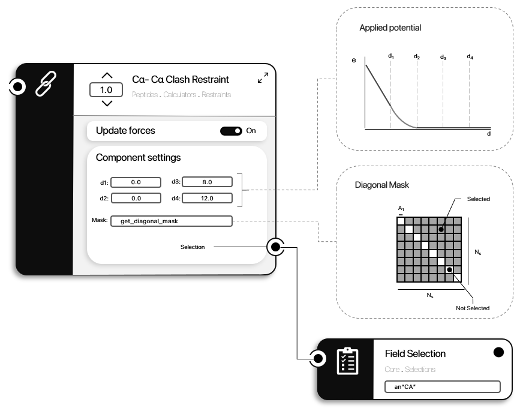

```@meta
CurrentModule = ProtoSyn.Peptides.Calculators.Restraints
```

# [Potential restraints](@id peptides-calculators-potential-restraints)

As previously stated, [Potential restraints](@ref peptides-calculators-potential-restraints) are a family of [`EnergyFunctionComponent`](@ref) instances that apply any given potential to a selection of [`Atom`](@ref) instances, optionally further masked or mapped. For more details on how [Potential restraints](@ref peptides-calculators-potential-restraints) work in ProtoSyn (and how to set-up custom potentials) check the Core module [Potential restraints](@ref calculators-potential-restraints) section. In the Peptides module, new (or improved) [Potential restraints](@ref peptides-calculators-potential-restraints) are introduced, organized in the following sub-sections:

+ [Cα - Cα Clash Restraint](@ref)
+ [Sidechain Clash Restraint](@ref)
+ [Contact Restraint](@ref)

## Cα - Cα Clash Restraint

The [Cα - Cα Clash Restraint](@ref) is a potential restraint (See [Potential restraints](@ref calculators-potential-restraints) for more details), applying a penalty for pairs of interacting Cα atoms with distances lower than a set value, thus reducing the occurrence of [`Residue`](@ref) overlaps (also known as clashes).

```@docs
get_default_ca_clash_restraint
```



**Figure 1 |** A diagram representation of the [Cα - Cα Clash Restraint](@ref) [`EnergyFunctionComponent`](@ref ProtoSyn.Calculators.EnergyFunctionComponent). The applied potential is a flat bottom function, with only the lower bound having and energy penatly. The `d1` and `d2` settings can be customly parametrized. This energy is only calculated for pair of interacting Cα [`Atom`](@ref) instances (in different [`Residue`](@ref) instances, as defined the the provided `AbstractSelection` and mask).

## Sidechain Clash Restraint

The [Sidechain Clash Restraint](@ref) is a potential restraint (See [Potential restraints](@ref calculators-potential-restraints) for more details), applying a penalty for pairs of interacting atoms (belonging to different sidechains) with distances under a given threshold.

```@docs
get_default_sidechain_clash_restraint
```


**Figure 1 |** A diagram representation of the [Sidechain Clash Restraint](@ref) [`EnergyFunctionComponent`](@ref ProtoSyn.Calculators.EnergyFunctionComponent). The applied potential is a flat bottom function, with only the lower bound having and energy penatly. The `d1` and `d2` settings can be customly parametrized. This energy is only calculated for pair of interacting [`Atom`](@ref) instances in sidechains of different [`Residue`](@ref) instances (as defined the the provided `AbstractSelection` and mask).

## Contact Restraint

The [Contact Restraint](@ref) is a potential restraint (See [Potential restraints](@ref calculators-potential-restraints) for more details), applying a penalty for pairs of interacting Cα atoms with distances larger than a set value defined in a contact map. For contact map generation, consider using the [RaptorX prediction server](http://raptorx.uchicago.edu/ContactMap/).

```@docs
get_default_contact_restraint
```


**Figure 1 |** A diagram representation of the [Contact Restraint](@ref) [`EnergyFunctionComponent`](@ref ProtoSyn.Calculators.EnergyFunctionComponent). The applied potential is a flat bottom function, with only the upper bound having and energy penatly. The `d3` and `d4` settings can be customly parametrized. This energy is only calculated for pair of interacting Cα [`Atom`](@ref) instances (in different [`Residue`](@ref) instances, as defined the the provided `AbstractSelection` and mask). The penalty scale is defined in the loaded contact map file.

!!! ukw "Note:"
    Most [Potential restraints](@ref peptides-calculators-potential-restraints) employ dynamic masks, by default. This can have a detrimental effect on performance. If no design effort is being performed, consider converting the dynamic masks to static masks. See [fixate_mask!](@ref ProtoSyn.Calculators.fixate_mask!)