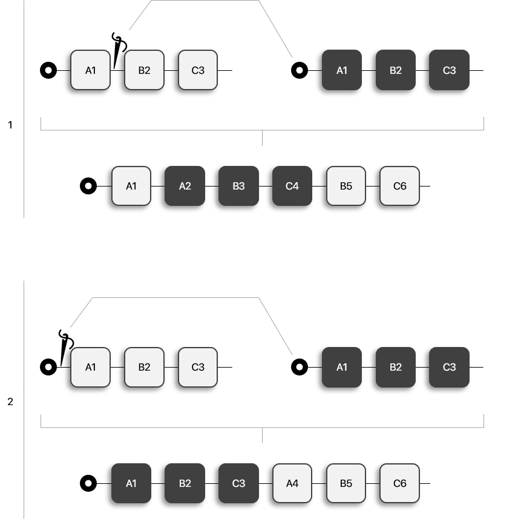
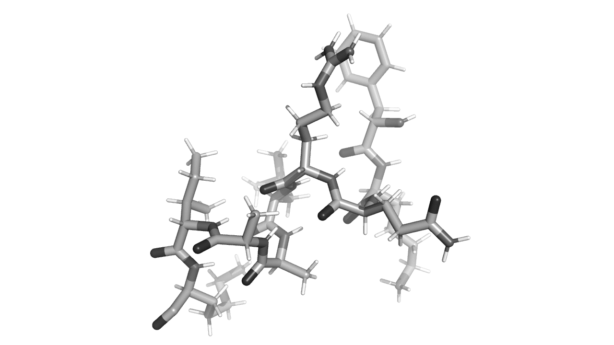
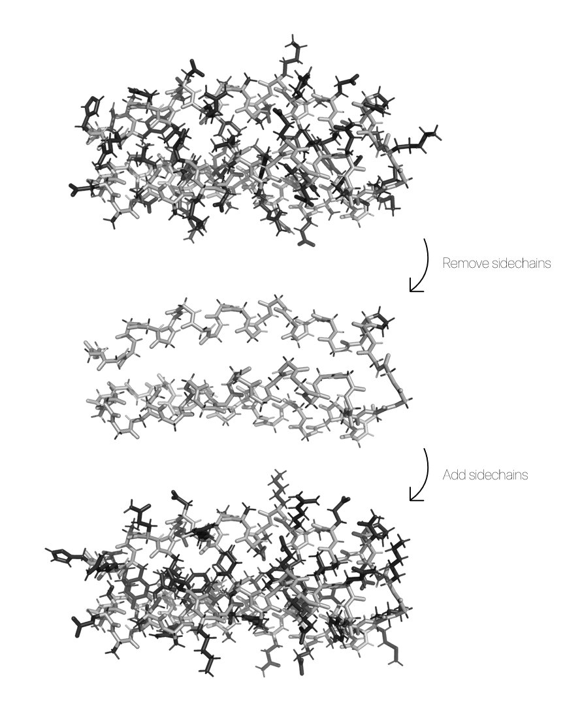
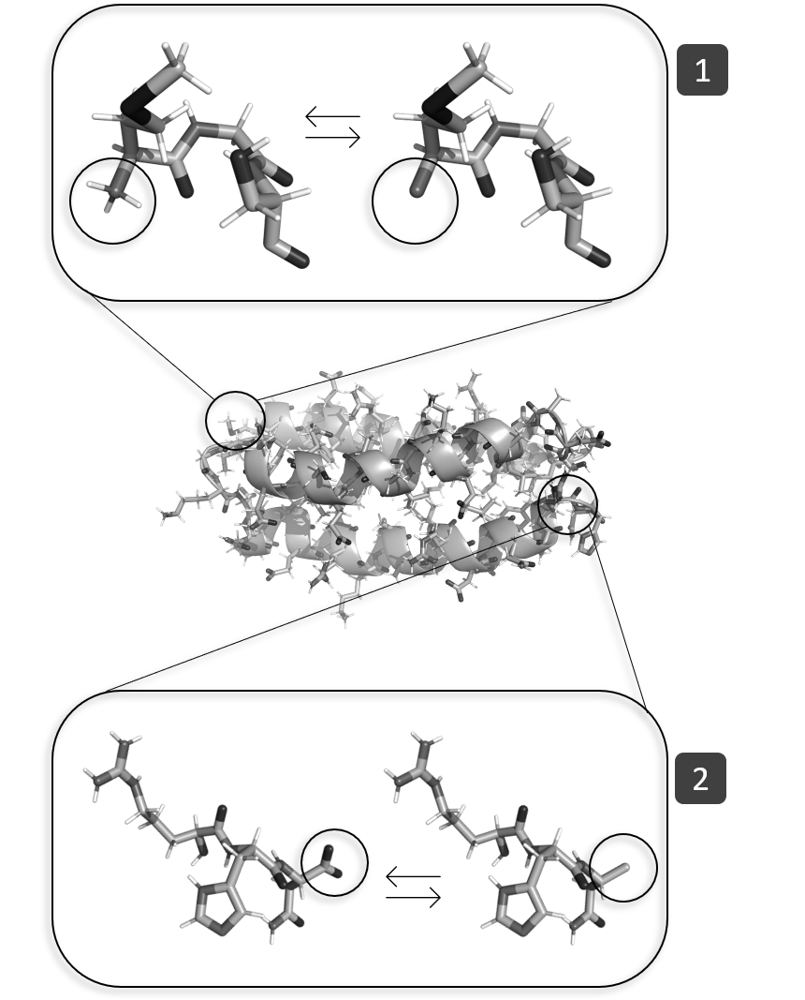

```@meta
CurrentModule = ProtoSyn.Peptides
```

# [Pose](@id peptides-pose-methods)

Included in the [Peptides](@ref) are a set of methods who primarily act on a [`Pose`](@ref) instance, expanding on the list of availabe Core functions (See [Pose](@ref pose-methods) methods). These are subdivided by topics, for organization purposes:

+ [Appending and inserting fragments](@ref)
+ [Mutating an aminoacid](@ref)
+ [Removing and adding sidechains](@ref)
+ [Removing and adding N- and C- terminal caps](@ref)

# Appending and inserting fragments

Expanding on the homologous Core functions, the next methods allow the user to append and insert [`Fragment`](@ref) instances in [`Pose`](@ref) instances (from [`Fragment`](@ref) instances or from a derivation (for example, `seq"AAA"`, a triplet of alanine aminoacids)). These expanded methods all add the possibility to set the [Secondary Structure](@ref) of the appendage (using the [`setss!`](@ref) method) and correct certain bond orientation artifacts introduced by the Core functions, specific to peptidic structures.

```@docs
append_fragment!(::Pose{Topology}, ::Residue, ::LGrammar, ::Pose{Segment}; ::Opt{SecondaryStructureTemplate}, ::Any)
```


**Figure 1 |** Two example applications of the [`append_fragment!`](@ref) method. **1 -** Appending a new [`Fragment`](@ref ProtoSyn.Fragment) (which can be one or more aminoacids) to the end of a peptidic structure (the [`Fragment`](@ref ProtoSyn.Fragment) is displayed in dark grey). The [`Residue`](@ref) instances are re-indexed (using the [`reindex!`](@ref ProtoSyn.reindex) method) and inserted in the [`Pose`](@ref) graph (sharing the [`root`](@ref ProtoSyn.root)). **2 -** A [`Fragment`](@ref ProtoSyn.Fragment) can also be appended to a severed cut (using the [`unbond!`](@ref ProtoSyn.unbond!) method or the [`fragment!`](@ref ProtoSyn.fragment!) method, for example). In this case, naturally, the downstream [`Residue`](@ref) instances are connected to the [`Pose`](@ref) [`root`](@ref ProtoSyn.root). Note that the appended aminoacids are ordered in such a way as to continue numerate (on index) from the [`Residue`](@ref) instance appended to.

```@docs
insert_fragment!(::Pose{Topology}, ::Residue, ::LGrammar, ::Pose{Segment}; ::Opt{SecondaryStructureTemplate}, ::Any)
```



**Figure 2 |** Two example applications of the [`insert_fragment!`](@ref) method. **1 -** Inserting a new [`Fragment`](@ref ProtoSyn.Fragment) (which can be one or more aminoacids) to the middle of a peptidic structure (the [`Fragment`](@ref ProtoSyn.Fragment) is displayed in dark grey). The [`Residue`](@ref) instances are re-indexed (using the [`reindex!`](@ref ProtoSyn.reindex) method) and inserted in the [`Pose`](@ref) graph (sharing the [`root`](@ref ProtoSyn.root)), while being connected in both upstream and downstream ends. **2 -** A [`Fragment`](@ref ProtoSyn.Fragment) can also be inserted at position 1 of the peptidic chain (in the beginning).

# Mutating an aminoacid

In a design effort, the objetive is to change the nature of an aminoacid (i.e.: change its sidechain), in order to stabilize a given interaction or conformation. Naturally, the main component necessary in such an algorithm is the ability to mutate an aminoacid, as explored in the next section.

```@docs
mutate!
force_mutate!
```



**Figure 3 |** Example of an aminoacid mutation cycle.

# Removing and adding sidechains

Certain coarse-grain [`EnergyFunctionComponent`](@ref ProtoSyn.Calculators.EnergyFunctionComponent) instances might not require an explicit sidechain. In certain algorithms, it might be, therefore, useful to remove the sidechains, lowering the degrees of freedom of a system and reducing the amount of particles simulated. In the next section, the methods used in ProtoSyn to remove and add sidechains in peptidic systems are explored.

```@docs
remove_sidechains!
force_remove_sidechains!
add_sidechains!
```



**Figure 4 |** Example of application of the [`remove_sidechains!`](@ref) and [`add_sidechains!`] methods. Note that, when re-adding the sidechains, the [`Rotamer`](@ref) conformation is set to be a default position, not recovering
the initial conformation without further processing.

# Removing and adding N- and C- terminal caps

When extending a peptide (by appending new [`Residue`](@ref) instances, for example), it might be useful to remove the N- and C-terminal caps, as well as add them back at a later point in the algorithm or design process. In this section, two methods for this task are explored.

```@docs
is_N_terminal
is_C_terminal
uncap!
cap!
```



**Figure 5 |** Example of application of the [`uncap!`](@ref) and [`cap!`] methods. Uncapping a terminal end of a peptide is usefull when appending new [`Residue`](@ref) instances, extending or adding an appendage.